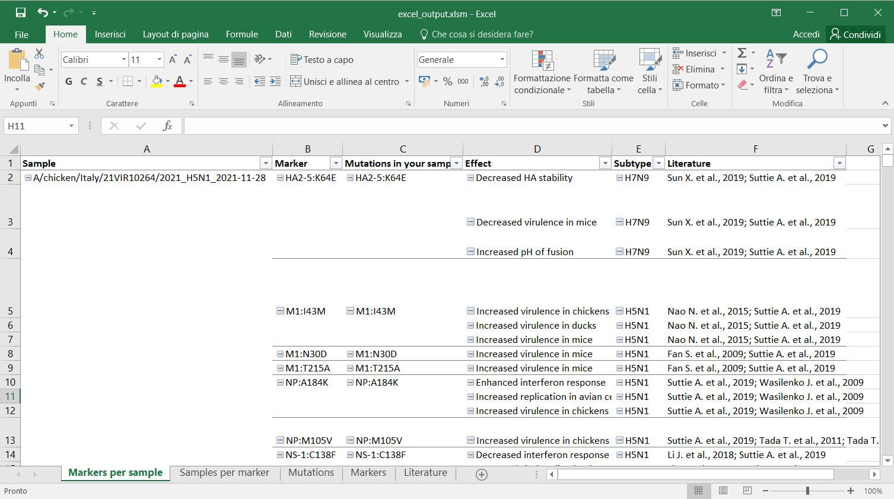
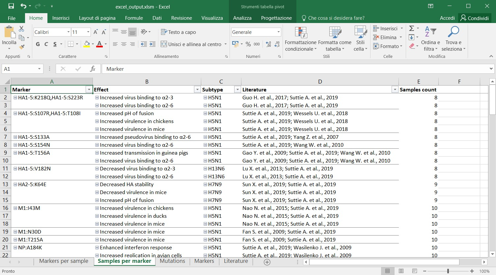
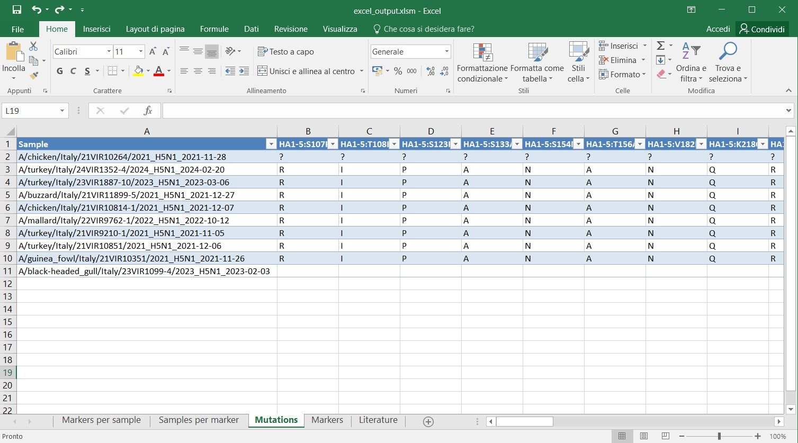
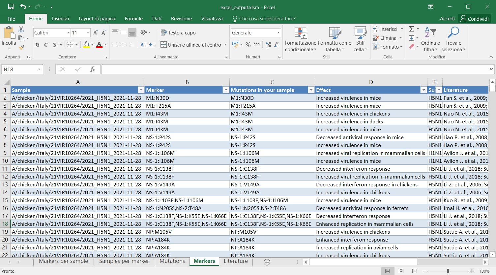
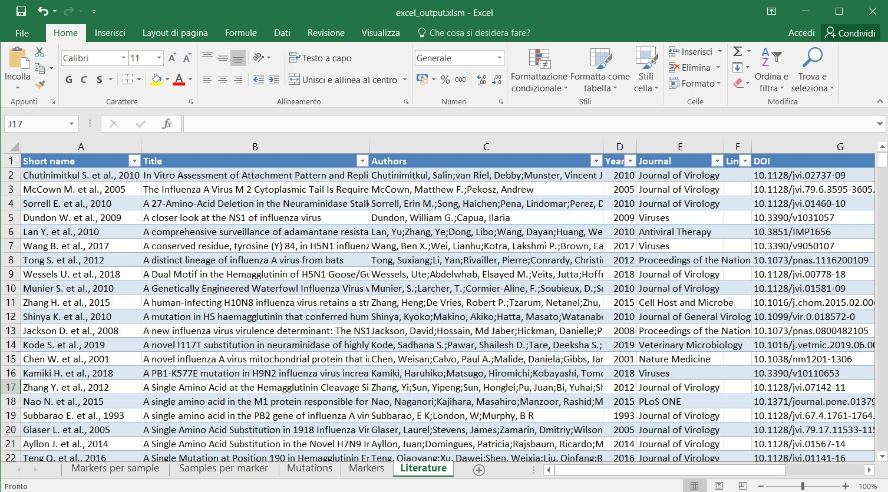

# Excel output
The Excel file is the most user-friendly output. 
It contains 5 sheets:
- [Markser per sample](#markers-per-sample-sheet)
- [Samples per marker](#samples-per-marker)
- [Mutations](#mutations)
- [Markers](#markers)
- [Literature](#literature)

## Markers per sample sheet
`Markers per sample` reports the list of the identified markers grouped according to the sample in which these markers are detected. 
Specifically, it displays six columns labelled:
- **_Sample_**: ID of the viruses of the submitted sequences;
- **_Marker_**: markers identified in the sequences and grouped based on the protein in which they are identified; if the --relaxed option is selected, all markers for which at least a mutation composing the marker is identified are reported
- **_Mutations in your sample_**: mutations composing the marker that are identified in the sequences analysed; if the --relaxed option is selected, this column allows to inspect which of the mutations composing the marker are identified in the analysed sequences.
- **_Effect_**: biological effects of the marker, as described in the literature; each marker can be associated to one or more effects (one row per effect)
- **_Subtype_**: influenza subtypes where the effect of the marker has been observed or tested (one row per subtype);
- **_Literature_**: bibliographic references where the marker has been described.

>**_Note_**: Double-clicking on cells in the "Marker" and/or "Mutations in your sample" columns, you are redirected to the "Mutations" sheet.
Similarly, by double-clicking on cells containing references in the "Literature" column you are redirected to the "Literature" sheet.
When you are redirected by double-clicking, columns are filtered to display only mutations in the selected marker.
Rows are filtered to display only papers describing the selected effect.

## Samples per marker
This sheet displays the list of the markers identified in the input sequences and the number of samples in which the marker is observed(column `Samples count`).
In this sheet the marker mutations are ordered by protein. 
If  `--relaxed` option is selected, also markers for which at least a single mutation is present in the input sequences are displayed.
>**_Note_**: Double-clicking on cells in the "Marker" and/or "Mutations in your sample" columns, you are redirected to the "Mutations" sheet. Similarly, by double-clicking on cells containing references in the "Literature" column you are redirected to the "Literature" sheet. When you are redirected by double-clicking, columns are filtered to display only mutations in the selected marker. Rows are filtered to display only papers describing the selected effect.

## Mutations
The `Mutations` spreadsheet shows, for each sample (one sample per raw) and for each mutation of interest found in at least one of the analysed sequences ( columns B, C, D, etc.), the amino acid present at the respective position.
The mutations are ordered alphabetically by per protein name, then by position and then by amino acid mutation.
In this way the mutations are grouped by protein and ordered by position.

| Symbol                  | Meaning |
| ----------              | ------- |
| blank cell              | no sequence available for that proteinposition for that sample |
| `-`                     | sequence deletion |
| `?`                     | unknown amino acid (at least an N is present in the codonie. nucleotide degeneration) |
| two or more amino acids | codon codes for two alternative amino acids (nucleotide degeneration within the codon causing a nonsynonymous mutation) |

>**_Note_**: by double-clicking on specific cells in the `Marker` and `Mutations in your sample` columns, the `Mutations` sheet will be filtered for the selected mutation.

## Markers
The `Markers` sheet lists for each sample, the marker and mutation identified. If the marker has multiple effects or it was tested on multiple subtypes it will be composed of different rows (one row per effect/subtype)

## Literature
The `Literature` sheet reports all the references present in the database.

# Mutations output
The “mutations_output.tsv” file reports in a tab-delimited value format all the information present in the “Mutations” sheet of the “excel_output.xlsm” file.

This table shows a comparison among the amino acids identified in the mutation positions in each input virus sequence (one sample per row). 
The sample name is reported in the first column followed by each mutation found in at least one of the analysed sequences in the following columns. 
The mutations are ordered alphabetically per protein name, position and amino acid mutation. 
In this way the mutations are grouped by protein and ordered by position.

>**_Note_**: a blank cell: no sequence available for that position for that sample; "-" sequence deletion; “?” unknown amino acid; a two amino acids: codon codes for two alternative amino acids (nucleotide degeneration within the codon causing a nonsynonymous mutation)

# Markers output 
The “markers_output.tsv” file reports all the information present in the “Markers” sheet of the “excel_output.xlsm” file, but in a tab-delimited value format.

The sample name is reported in each row (first column) with the “Marker” searched and the “Mutations in your sample” found for that sample, followed by the “Effect” of that mutation, the “Subtype” where that mutation was tested and the reference study.

If the marker has multiple effects or it was tested on multiple subtypes, this information is splitted on multiple rows.
